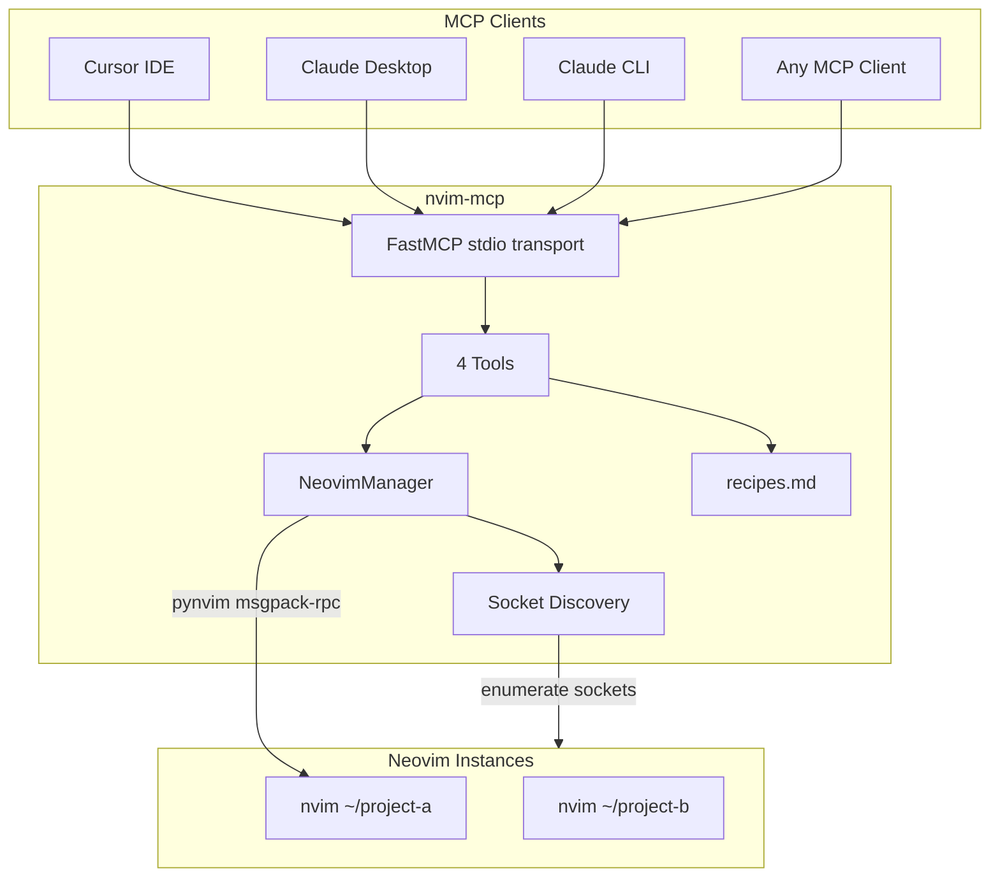
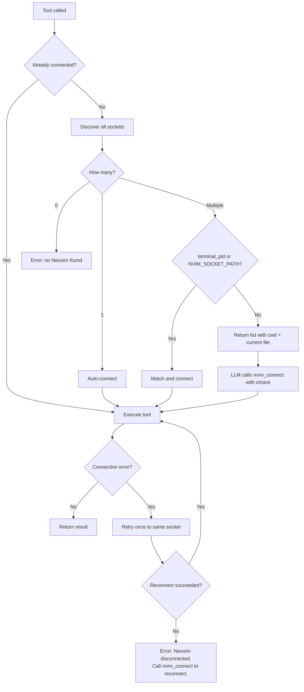

# Build nvim-mcp

New standalone project.

## Architecture



## Design Philosophy

- The LLM already knows Vim. Give it one pipe (`nvim_send`) and a recipe book (`nvim_recipes`), not 19 wrappers.
- Auto-discover Neovim instances. Don't require config for the common case (one instance).
- Only include Vim-specific recipes. The LLM can run shell commands, read files, etc. through other means. Recipes cover what you can *only* do through Neovim.
- No Cursor-specific files in this repo. Cursor integration docs go in the README.
- **Linux and macOS only.** Socket discovery, `pgrep`, and all path conventions assume Unix. Windows uses named pipes for Neovim IPC and has no `pgrep` — supporting it would require a different discovery backend.

### Editing Boundary

**The LLM never edits text through Neovim.** All text modifications — writing code,
search-and-replace, indenting, sorting, formatting — are done by the LLM using its own
file editing tools, then Neovim is told to reload:

```
LLM edits foo.py on disk  →  nvim_send(input="checktime", mode="command")
```

Neovim's role is strictly:
- **Navigation** — open files, go to lines, manage splits/tabs/windows
- **State** — what file, cursor position, mode, buffer layout, modified status
- **LSP** — go-to-definition, references, hover, rename, diagnostics (the LSP client runs in Neovim with project context the LLM doesn't have)
- **Vim-specific read operations** — marks, registers, folds, quickfix list
- **User sync** — `checktime` to reload buffers after the LLM edits files on disk

This means `nvim_send` is used for commands like `:e`, `:w`, `:42`, `:vs`, `:wincmd w`,
`:checktime`, and for eval queries — not for text manipulation commands like `:%s`,
`:sort`, `:normal`, or keystroke sequences that modify buffer content.

## Why 4 Tools

Considered merging and splitting; 4 is the right number.

- **nvim_connect** stays separate from nvim_send. Connection logic (discovery, disambiguation, caching) is a distinct concern. Merging it into nvim_send would mean every send call carries optional connection parameters. That's confusing for the LLM and violates single-responsibility.
- **nvim_send** with 3 modes (command/eval/keys) stays as one tool. All three modes represent "talk to Neovim" — the mode is just how. Splitting into 3 tools would triple the LLM's tool surface area with no benefit. The mode parameter provides clear dispatch.
- **nvim_state** stays separate from nvim_send eval mode. It returns a *structured dict*, not a raw Vim expression result. The LLM would need to compose a complex multi-expression eval to get the same data, and would need to parse the result. A dedicated tool is clearer and cheaper (one LLM tool call vs. one tool call + a prompt to build the expression).
- **nvim_recipes** is documentation, not Neovim interaction. It reads from a bundled file, no Neovim connection needed. Structurally different from the other three.

An `nvim_open` tool (mirroring the bash script's fuzzy search) was considered and rejected. The LLM already has file discovery through its own tools. Opening a file is just `nvim_send(input="e /path/to/file", mode="command")`. The fuzzy-search feature of the bash script solved a bash-ergonomics problem, not a Neovim problem.

## Instance Discovery



Socket discovery priority:
1. `socket_path` parameter or `NVIM_SOCKET_PATH` env var — explicit, universal
2. `terminal_pid` parameter — walk process tree descendants, match to socket
3. Auto-discover — glob `nvim*` sockets under standard paths, query each via pynvim `getpid()`

Socket search paths (in order, deduplicated by resolved path):
1. `$XDG_RUNTIME_DIR` if set (Neovim's first choice on any OS)
2. `/run/user/$UID` (Linux default when XDG_RUNTIME_DIR is unset)
3. `$TMPDIR` (macOS default — typically `/var/folders/.../T/`, not `/tmp`)
4. `/tmp` (universal fallback)

Glob pattern: `nvim*` of type socket, `maxdepth 4`.

Stale socket handling: During discovery, each socket is probed with a pynvim `attach()` +
`eval('getpid()')`. If the connection fails (socket exists but process is dead), catch the
exception and skip. Don't delete stale socket files. **Probes run concurrently** via
`asyncio.gather(asyncio.to_thread(probe, sock) for sock in candidates)` — sequential
probing with 5s timeouts would make discovery O(stale_count * 5s) on systems with
accumulated dead sockets.

Discovery caching: `discover()` caches results for 30 seconds (timestamp + list). A second
`nvim_connect` call within that window (e.g., LLM listing instances then picking one) reuses
the cache instead of re-probing.

Process tree walking for `terminal_pid`: recursive `subprocess.run(['pgrep', '-P', str(pid)])`
to get descendants, then match PIDs against discovered sockets. Mirrors the bash script's
`get_descendants()` logic. No `psutil` dependency — `pgrep -P` works on both Linux and macOS,
though the implementations differ (procps-ng vs proctools). Test on both.

## Project Structure

```
nvim-mcp/
├── pyproject.toml            # [project.scripts] nvim-mcp = "nvim_mcp.server:main"
├── src/
│   └── nvim_mcp/
│       ├── __init__.py
│       ├── server.py          # FastMCP server, 4 tools, main() entry point
│       ├── neovim.py          # NeovimManager
│       ├── recipes.py         # Load + filter recipes.md
│       └── recipes.md         # Inside package for importlib.resources
├── tests/
│   ├── test_recipes.py        # Recipe parsing + filtering
│   └── test_neovim.py         # NeovimManager with mocked pynvim
├── README.md
├── LICENSE
└── .gitignore
```

Nothing else. No rule files, no bash scripts, no settings docs.

## Tools (4)

### nvim_connect

`(socket_path?: str, terminal_pid?: int, index?: int)` — *index is 1-based, matching the numbered list shown to the LLM*

Connect to a Neovim instance. No args = auto-connect if one instance, list all if
multiple (showing cwd + current file for each). With `index` = pick from list. With
`socket_path` = direct. With `terminal_pid` = walk process tree to match. Sticky — once
connected, all subsequent calls use that instance.

Returns:
- On success: `"Connected to nvim at <socket_path> (cwd: <cwd>, file: <file>)"`
- On multiple found (no disambiguator): list of instances with index, cwd, current file, socket path
- On zero found: `"Error: no Neovim instances found. Is Neovim running?"`

---

### nvim_send

`(input: str, mode: "command" | "eval" | "keys" = "command")`

The universal Neovim interface. One tool, three modes:
- `command`: Run an ex command **without** the leading `:`. E.g. `e /path/to/file`, `w`, `42`, `vs other.py`, `checktime`
- `eval`: Evaluate expression, return result. E.g. `getcwd()`, `expand('%:p')`, `line('$')`
- `keys`: Send keystrokes for navigation. E.g. `gg`, `G`, `za`, `zR`

Auto-connects if not connected and only one instance exists. If multiple instances exist
and no connection is established, returns an error directing the LLM to call `nvim_connect`.

Mode behaviors:
- **command**: Executes via a single `exec_lua()` call that clears `v:errmsg`, runs
  `vim.api.nvim_exec2(input, {output=true})`, and returns both the command output and
  `v:errmsg`. Commands that produce output (e.g. `:ls`, `:marks`, `:pwd`) return that
  output. If `v:errmsg` is non-empty, the error text is included. This gives the LLM
  actionable results and error messages.
- **eval**: Calls `nvim.eval(input)`. Returns the expression result directly (string,
  number, list, dict — whatever Vim returns). On `NvimError`, returns the error message.
- **keys**: Prepends `<Esc>` (to normalize Vim state — exits insert/visual/pending-operator
  mode), then sends via `nvim.input()`. Returns `"Keys sent: <input>"`. **Limitation:**
  keystrokes are fire-and-forget. There is no error feedback. The LLM should call
  `nvim_state` afterward if it needs to confirm the effect.

---

### nvim_state

`()`

Structured snapshot in a single round-trip. Returns a dict:

```python
{
    "file": "/absolute/path/to/file.py",
    "line": 42,
    "col": 10,
    "mode": "n",
    "modified": False,
    "filetype": "python",
    "total_lines": 350,
    "cwd": "/home/user/project",
    "relativenumber": True,
    "windows": [
        {"file": "/absolute/path/to/file.py", "modified": False, "active": True},
        {"file": "/absolute/path/to/other.py", "modified": True, "active": False},
    ],
    "modified_buffers": ["/absolute/path/to/other.py"],
    "buffer_count": 5,
}
```

`file` is `""` for unnamed/scratch buffers. Same for `windows[].file`.

The `windows` list gives the LLM spatial awareness of the editor layout (what's visible
in splits). Bounded by screen real estate — rarely more than 4-6 entries.
`modified_buffers` alerts it to unsaved work in background buffers.

Fetched via a single `nvim.exec_lua()` call (Python sends this Lua string to Neovim,
pynvim deserializes the returned Lua table into a Python dict automatically):

```lua
local wins = {}
for _, w in ipairs(vim.api.nvim_tabpage_list_wins(0)) do
    local b = vim.api.nvim_win_get_buf(w)
    wins[#wins + 1] = {
        file = vim.api.nvim_buf_get_name(b),
        modified = vim.bo[b].modified,
        active = (w == vim.api.nvim_get_current_win()),
    }
end
local modified = {}
local buf_count = 0
for _, b in ipairs(vim.api.nvim_list_bufs()) do
    if vim.bo[b].buflisted and vim.api.nvim_buf_is_loaded(b) then
        buf_count = buf_count + 1
        if vim.bo[b].modified then
            modified[#modified + 1] = vim.api.nvim_buf_get_name(b)
        end
    end
end
return {
    file = vim.fn.expand('%:p'),
    line = vim.fn.line('.'),
    col = vim.fn.col('.'),
    mode = vim.fn.mode(),
    modified = vim.bo.modified,
    filetype = vim.bo.filetype,
    total_lines = vim.fn.line('$'),
    cwd = vim.fn.getcwd(),
    relativenumber = vim.wo.relativenumber,
    windows = wins,
    modified_buffers = modified,
    buffer_count = buf_count,
}
```

---

### nvim_recipes

`(category?: str)`

No args = quick reference (top 9 operations) + list of all category names. With
category = full recipes for that section. Reads from the bundled `recipes.md`.

Parsing: split `recipes.md` on `^## ` headers. Each header becomes a category key (lowercased,
stripped). Category body is everything until the next `^## ` or EOF. The quick reference is
a hardcoded list in `recipes.py`, not parsed from the file.

## recipes.md — Navigation, State, and LSP Only

No text editing recipes. The LLM edits files on disk with its own tools and calls
`checktime` to reload. 8 categories:

### 1. Files
Open, save, save-as, close buffer, reload from disk (`checktime`, `e!`), new buffer.

### 2. Navigation
Goto line, top/bottom, matching bracket, jump list, change list, last edit position, goto local definition.

### 3. Buffers
List, switch by number/name, next/prev, delete, buffer info.

### 4. Windows & Tabs
Split, vsplit, close, only, navigate, resize, equalize. Tab new/close/next/prev/list/goto.

### 5. Marks
Set local (a-z), set global (A-Z), jump to mark, list, delete. Special marks: last edit,
last position, change bounds.

### 6. Registers
Set/get via eval, list, yank to register. Special: clipboard, last yank, last insert,
last command, last search.

### 7. Folds
Open/close/toggle, open/close all, create range fold, delete fold.

### 8. LSP & Diagnostics
Definition, references, hover, rename, code action, format. Diagnostic navigation,
diagnostic list, get diagnostics as data.

### Quick Reference (top 9)

Returned when `nvim_recipes()` is called with no category:

1. **Open file:** `nvim_send(input="e /path/to/file", mode="command")`
2. **Save file:** `nvim_send(input="w", mode="command")`
3. **Go to line:** `nvim_send(input="42", mode="command")`
4. **Reload from disk:** `nvim_send(input="checktime", mode="command")`
5. **Close buffer:** `nvim_send(input="bd", mode="command")`
6. **Vertical split:** `nvim_send(input="vs /path/to/file", mode="command")`
7. **Navigate windows:** `nvim_send(input="wincmd w", mode="command")`
8. **LSP go-to-definition:** `nvim_send(input="lua vim.lsp.buf.definition()", mode="command")`
9. **LSP references:** `nvim_send(input="lua vim.lsp.buf.references()", mode="command")`

### Example recipe section format

```
## Files
- Open file: nvim_send(input="e /path/to/file", mode="command")
- Save: nvim_send(input="w", mode="command")
- Save as: nvim_send(input="saveas /path/to/newfile", mode="command")
- Close buffer: nvim_send(input="bd", mode="command")
- Reload from disk: nvim_send(input="checktime", mode="command")
- Force reload: nvim_send(input="e!", mode="command")
- New buffer: nvim_send(input="enew", mode="command")
```

## NeovimManager (src/nvim_mcp/neovim.py)

Singleton. Manages discovery, connection caching, and all Neovim communication via pynvim.

### Concurrency Model

pynvim is fully synchronous — `attach()`, `command()`, `eval()`, and `input()` all block.
FastMCP is async. Two constraints:

1. **Don't block the event loop.** Every pynvim call goes through `asyncio.to_thread()`.
2. **Don't corrupt the RPC stream.** pynvim's connection is not thread-safe. An
   `asyncio.Lock` serializes all Neovim access — one RPC at a time. The lock is acquired
   before dispatching to `to_thread()`, so the event loop is never blocked.

Connection via `pynvim.attach()` is wrapped in `asyncio.wait_for(..., timeout=5.0)` to
avoid hangs on dead sockets. Note: `wait_for` cancels the asyncio Future but cannot kill
the underlying thread — Python threads are not interruptible. In practice, Unix socket
connections fail fast (connection refused), so hangs are unlikely. If a thread does leak,
it will be cleaned up when the process exits.

```python
class NeovimManager:
    def __init__(self):
        self._nvim: pynvim.Nvim | None = None
        self._socket_path: str | None = None
        self._lock = asyncio.Lock()

    async def send(self, input: str, mode: str) -> str:
        async with self._lock:
            try:
                return await asyncio.to_thread(self._send_sync, input, mode)
            except (OSError, NvimError) as e:
                if not self._is_connection_error(e):
                    raise
                await self._reconnect()
                return await asyncio.to_thread(self._send_sync, input, mode)
```

### NvimInstance

```python
@dataclass
class NvimInstance:
    socket_path: str
    pid: int
    cwd: str
    current_file: str
```

### Methods

- **`async discover()`** — find all nvim sockets via `_all_sockets()`. For each candidate:
  attempt `pynvim.attach()` in a thread with 5s timeout, query pid/cwd/current_file.
  Skip sockets that fail to connect (stale). Return `list[NvimInstance]`.

- **`async connect(socket_path?, terminal_pid?, index?)`** — resolve target,
  `pynvim.attach('socket', path=...)` via `to_thread`, cache as `self._nvim` and
  `self._socket_path`.

- **`_send_sync(input, mode)`** — synchronous dispatch (called via `to_thread`):
  - `command`: `self._nvim.exec_lua(...)` — clears `v:errmsg`, runs
    `vim.api.nvim_exec2(input, {output=true})`, returns command output + `v:errmsg`.
    One round-trip, captures both output and errors atomically.
  - `eval`: `self._nvim.eval(input)`. Catches `NvimError`, returns error text.
  - `keys`: `self._nvim.input('<Esc>' + input)`. Returns confirmation string.

- **`_get_state_sync()`** — single `self._nvim.exec_lua(...)` returning the full state
  dict (cursor, file, windows, modified buffers, etc.).

- **`async get_state()`** — acquires lock, calls `to_thread(self._get_state_sync)`.

- **`_find_socket_for_terminal(pid)`** — recursive `subprocess.run(['pgrep', '-P', ...])` to
  get descendant PIDs, then match against discovered sockets.

- **`async _reconnect()`** — set `self._nvim = None`, re-attach to `self._socket_path`
  via `to_thread` with 5s timeout. If reconnect fails, return a clear error:
  `"Neovim disconnected. Call nvim_connect to reconnect."` No proactive health checks —
  connection errors are caught at the call site and trigger one retry.

- **`_all_sockets()`** — synchronous. Glob `nvim*` type socket under `$XDG_RUNTIME_DIR`,
  `/run/user/$UID`, `$TMPDIR`, `/tmp`. Maxdepth 4. Deduplicate by `os.path.realpath()`.

### Error Handling

| Situation | Behavior |
|-----------|----------|
| Invalid ex command | `v:errmsg` captured and returned as text. LLM sees the error and self-corrects. |
| Invalid eval expression | `NvimError` caught, error message returned as text. |
| Keys mode error | No feedback (fire-and-forget). LLM should call `nvim_state` to confirm. |
| Connection lost mid-call | Caught as connection error, `_reconnect()` retries once to same socket. If retry fails, return `"Neovim disconnected. Call nvim_connect to reconnect."` |
| Neovim in insert/visual mode | `<Esc>` prepended in keys mode. Command and eval modes use RPC directly, unaffected by Vim mode. |
| No connection + single instance | Auto-connect silently, then execute. |
| No connection + multiple instances | Return error with instance list, direct LLM to call `nvim_connect`. |
| Socket exists but process dead | Skip during discovery. If cached connection, reconnect flow handles it. |
| pynvim.attach() hangs | `asyncio.wait_for` with 5s timeout, translated to clear error message. |

## README.md

Sections:
- What it is (one paragraph)
- Install: `uv tool install nvim-mcp` or `uvx nvim-mcp`
- Quick start: start nvim, configure MCP client, done
- Multi-instance: how discovery works, how to pick
- Client setup: Cursor, Claude Desktop, Claude CLI, generic
- Cursor integration appendix: recommended `.mdc` rule content (code block to copy-paste)
- Recipes reference: link to `src/nvim_mcp/recipes.md`
- `NVIM_SOCKET_PATH` env var docs
